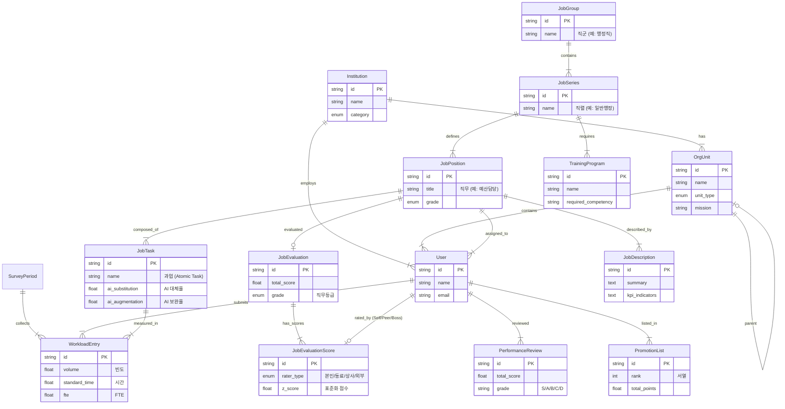

# Grand Principles: System Entity Relationship Diagram (ERD)

This document serves as the **Constitution** of the Job Management System. It defines the Data Architecture, UX/UI Philosophy, and Technical Standards.

## 1. UX/UI Design Principles (The "Intuitive" Standard)
> "Users should never have to guess. The interface must be self-explanatory."

1.  **Zero Learning Curve**: No manuals required. Use familiar metaphors (e.g., Excel-like grids, Shopping Cart style selection).
2.  **Visual Feedback**: Every action (save, delete, calculate) must have an immediate visual response (toast, color change, animation).
3.  **Error Prevention**: Validate data *before* submission. Use sliders and dropdowns instead of free text where possible.
4.  **Contextual Help**: AI-driven tooltips appear only when needed, explaining *why* a task is important, not just *how* to do it.
5.  **Information Hierarchy**: Most important data (e.g., Total Score, Grade) is biggest and boldest. Secondary data is accessible on demand.

## 2. Data Architecture (ERD)
This diagram represents the **12-Module Architecture** of the Public Institution Job Management System.

