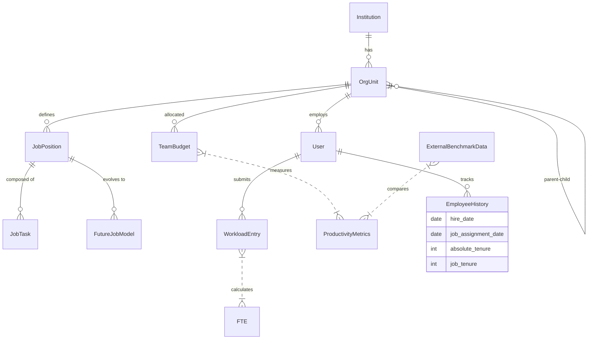

# 직무관리시스템 마스터 아키텍처 (Job Management System Master Architecture)

이 문서는 "나노바나나" 도면을 대체하는 **고밀도 시스템 구조도**입니다.
**정부 가이드라인** 준수, **조직 캐스케이딩**, 그리고 **외부 벤치마킹(HCROI/HCVA)** 흐름을 포함합니다.

```mermaid
graph TD
    %% ---------------------------------------------------------
    %% 1. Core Data Layer (기준 정보)
    %% ---------------------------------------------------------
    subgraph CoreData [1. 기준 정보 (Core Data)]
        direction TB
        NCS[NCS 표준 DB]
        JG[직군 (Job Group)]
        JS[직렬 (Job Series)]
        JP[직무 (Job Position)]
        
        NCS -->|Mapping| JP
        JG --> JS --> JP
        
        subgraph OrgHierarchy [조직 위계 (Org Hierarchy)]
            HQ[본부 (HQ)] --> Office[실 (Office)]
            Office --> Team[팀 (Team)]
            Team --> RR[주무 (R&R)]
        end
        
        Team -->|Budget| TeamBudget[팀 예산 (Budget)]
        RR --> User[사용자 (User)]
    end

    %% ---------------------------------------------------------
    %% 2. Job Analysis & Classification (직무 분석/분류)
    %% ---------------------------------------------------------
    subgraph JobAnalysis [2. 직무 분석 및 분류 (Analysis)]
        direction TB
        Survey[직무 조사표 (Survey)]
        Response[조사 응답 (Response)]
        TaskDic[표준 과업 사전 (Task Dictionary)]
        FutureModel[미래 직무 모델 (Future Model)]
        
        User -->|Submit| Response
        Response -->|Analyze| TaskDic
        TaskDic -->|Define| JP
        
        HQ -->|Mission Cascading| RR
        FutureModel -.->|To-Be Design| JP
    end

    %% ---------------------------------------------------------
    %% 3. Workload & Headcount (업무량 및 정원)
    %% ---------------------------------------------------------
    subgraph Workload [3. 업무량 및 정원 (Workload & Headcount)]
        direction TB
        Vol[물량 (Volume)]
        ST[표준시간 (Standard Time)]
        FTE[FTE 산출 (Full Time Equivalent)]
        
        subgraph Productivity [생산성 분석 (Productivity)]
            ExtBench[외부 벤치마킹 DB<br/>(유사기관/예산/정원)]
            HCROI[HCROI 산출]
            HCVA[HCVA 산출]
        end
        
        HC_Plan[적정 인력 (Appropriate Workforce)]
        OrgDesign[조직 설계 (Org Design)]
        
        TaskDic --> ST
        Response --> Vol
        Vol --> FTE
        ST --> FTE
        
        FTE --> HC_Plan
        TeamBudget -->|Revenue/Cost| HCROI
        TeamBudget -->|Revenue/Cost| HCVA
        FTE -->|Input| HCVA
        ExtBench -->|Compare| HCROI
        ExtBench -->|Compare| HCVA
        
        HC_Plan -->|Gap Analysis| OrgDesign
    end

    %% ---------------------------------------------------------
    %% 4. Evaluation & Compensation (평가 및 보상)
    %% ---------------------------------------------------------
    subgraph Evaluation [4. 직무 평가 (Evaluation)]
        direction TB
        Factor[평가 요소 (Factors)]
        PointTable[점수표 (Point Table)]
        JobScore[직무 점수 (Job Score)]
        Grade[직무 등급 (Job Grade)]
        
        Factor --> PointTable
        JP -->|Evaluate| JobScore
        PointTable -->|Calc| JobScore
        JobScore --> Grade
    end

    %% ---------------------------------------------------------
    %% 5. HR Application (인사 활용)
    %% ---------------------------------------------------------
    subgraph HR_App [5. 인사 활용 (HR Application)]
        direction TB
        JD_Gen[직무기술서 자동생성 (JD Gen)]
        KPI[핵심성과지표 (KPI)]
        Comp[역량 모델 (Competency)]
        Appraisal[인사평가 (Appraisal)]
        Promo[승진서열 (Promotion)]
        Edu[교육과정 (Education)]
        IDP[개인개발계획 (IDP)]
        
        JP --> JD_Gen
        Grade --> JD_Gen
        
        JP --> KPI
        JP --> Comp
        
        KPI --> Appraisal
        Comp --> Appraisal
        
        Appraisal --> Promo
        Appraisal -->|Gap Analysis| IDP
        IDP --> Edu
    end

    %% ---------------------------------------------------------
    %% 6. Dashboards & Outputs (출력물)
    %% ---------------------------------------------------------
    subgraph Output [6. 대시보드 및 출력물 (Outputs)]
        direction TB
        JobCard[직무관리카드 (Job Card)]
        PersonCard[인사기록카드 (Person Card)]
        
        subgraph Proficiency [숙련도 (Proficiency)]
            AbsTenure[절대 근속 (Absolute)]
            JobTenure[직무 근속 (Job-Specific)]
        end
        
        JD_Gen --> JobCard
        JobScore --> JobCard
        FTE --> JobCard
        HCROI --> JobCard
        HCVA --> JobCard
        
        User --> PersonCard
        Appraisal --> PersonCard
        Edu --> PersonCard
        AbsTenure --> PersonCard
        JobTenure --> PersonCard
    end

    %% ---------------------------------------------------------
    %% Cross-Module Relationships
    %% ---------------------------------------------------------
    JobAnalysis --> Workload
    Workload --> Evaluation
    Evaluation --> HR_App
    HR_App --> Output
    
    style CoreData fill:#f9fafb,stroke:#6b7280,stroke-width:2px
    style JobAnalysis fill:#dbeafe,stroke:#3b82f6,stroke-width:2px
    style Workload fill:#dcfce7,stroke:#10b981,stroke-width:2px
    style Evaluation fill:#fef3c7,stroke:#f59e0b,stroke-width:2px
    style HR_App fill:#f3e8ff,stroke:#a855f7,stroke-width:2px
    style Output fill:#ffe4e6,stroke:#f43f5e,stroke-width:2px
    style Productivity fill:#ffffff,stroke:#059669,stroke-dasharray: 5 5
```

## 데이터베이스 엔티티 관계도 (ERD)


