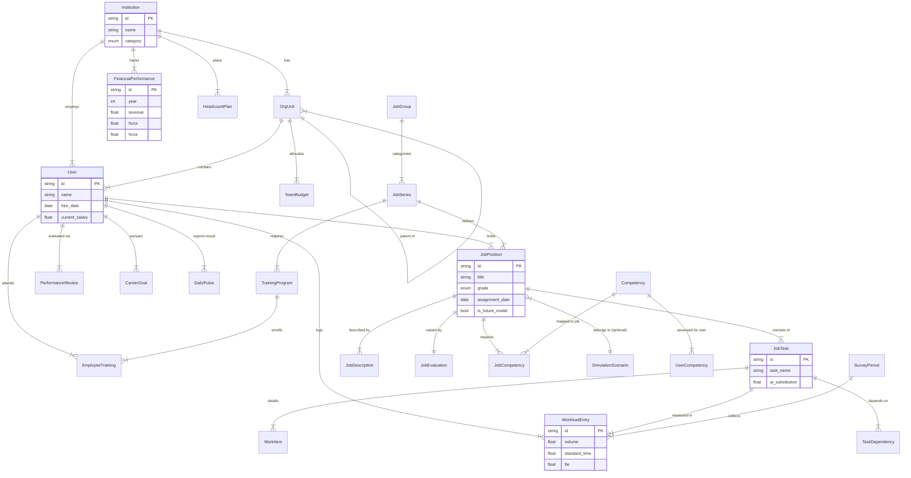

# Job Management System - System Architecture & Design Document

## 1. System Overview
The **Job Management System v2.0 Enterprise Edition** is a comprehensive Human Capital Management (HCM) platform designed to transition organizations from subjective, person-based management to objective, job-based management. It integrates scientific workload analysis, productivity metrics (HCROI/HCVA), and strategic workforce planning into a unified Apple-style interface.

### core Philosophy
- **Job-Centric Architecture**: All HR processes (Evaluation, Compensation, Hiring) revolve around well-defined Job Positions and Tasks.
- **Data-Driven Decision Making**: Moving from "gut feeling" to quantifiable metrics (FTE, Workload Volume, Productivity).
- **Strategic Alignment**: Connecting individual tasks to organizational goals and financial performance.

## 2. Technology Stack

### Frontend
- **Framework**: Next.js 14 (App Router)
- **Language**: TypeScript
- **UI Library**: Mantine UI v7 (Enterprise Components)
- **Styling**: Tailwind CSS (Utility) + CSS Modules (Custom Glassmorphism)
- **State Management**: React Context (Language, Theme) + SWR/TanStack Query (Data Fetching)
- **Visualization**: Recharts (Productivity Charts), Mermaid (Diagrams)

### Backend
- **Framework**: FastAPI (High-performance Python API)
- **Database ORM**: SQLAlchemy (Async support prepared)
- **Database**: PostgreSQL (Production) / SQLite (Dev/Local)
- **Validation**: Pydantic V2
- **Testing**: Pytest

## 3. Entity Relationship Diagram (ERD)

## 4. Information Architecture (IA) & Sitemap

The application uses a hierarchal navigation structure categorized by functional domain.

### **1. Dashboard (Main)**
- **Role**: Executive Summary & Notifications
- **Key Metrics**: Daily Pulse status, Urgent tasks, Headcount alerts.

### **2. Organization & Jobs (조직 및 직무)**
- **Job Classification (`/job-classification`)**: 
    - Tree view of Job Groups -> Series -> Positions.
    - Drag-and-drop reclassification.
- **Job Descriptions (`/job-descriptions`)**: 
    - AI-generated JD viewer and editor.
    - Version control for JDs.
- **Job Evaluation (`/job-evaluation`)**: 
    - Point-factor method scoring (Expertise, Responsibility, Complexity).
    - Grade classification matrix.
- **Org Chart / Span of Control (`/admin/span-of-control`)**: 
    - Visual hierarchy.
    - Analytics on manager-to-staff ratios.

### **3. Workforce & Analysis (인력 및 분석)**
- **Workforce Planning (`/workforce-planning`)**:
    - TO (Table of Organization) vs. Actuals.
    - Gap analysis.
- **Workload Analysis (`/workload-analysis`)**:
    - FTE calculation based on survey data.
    - Task volume and standard time metrics.
- **Simulation Board (`/simulation`)**:
    - **Productivity Dashboard**: HCROI, HCVA trends.
    - **Scenario Builder**: "What-if" analysis for reorgs.

### **4. Personnel & Career (인사 및 경력)**
- **Personnel Records (`/personnel-record`)**:
    - Dual Tenure View (Organization Tenure vs. Job Tenure).
    - Specialization Ratio.
- **Performance Mgmt (`/performance-management`)**:
    - MBO / KPI setting.
    - Year-end reviews.
- **Career Development (`/career-development`)**:
    - IDP (Individual Development Plan).
    - Career path visualization.
- **Talent Mapping (`/scientific-hr/9-box`)**:
    - 9-Box Grid (Performance vs. Potential).
- **Competency Radar (`/admin/competency`)**:
    - User vs. Job competency gap analysis (Radar Chart).

### **5. AI Intelligence (`/scientific-hr`)**
- **AI Semantic Search (`/ai-search`)**: Natural language query for HR data.
- **JD Generator (`/jd-generator`)**: LLM-based content creation.
- **Smart Gap Analysis (`/smart-gap-analysis`)**: Automated skill gap detection.
- **Predictive Analytics (`/admin/prediction`)**: Flight risk, future headcount prediction.

### **6. Employee Experience (`/my-job`)**
- **My Job**: Mobile-first view for employees to view their own JD and output.
- **Job Survey**: Interface for entering workload data.

## 5. Security & Compliance
- **Authentication**: JWT based stateless auth.
- **RBAC**: Role-Based Access Control (Admin, Manager, Employee).
- **Audit Logs**: Critical actions (Promotion, Salary Change) are logged in `ERPSyncLog`.
