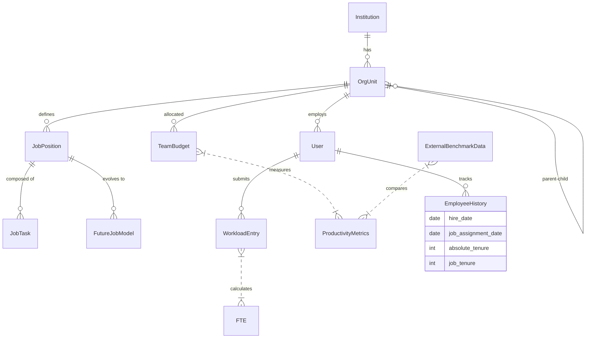

# 직무관리시스템 고도화 통합 기획안 (Job Management System Integrated Plan)

> **Version**: 2.0 (Consolidated)
> **Last Updated**: 2025-12-12
> **Authors**: Strategic CTO (Antigravity)

## 1. 개요 (Overview)
본 기획안은 **정부의 직무중심 인사관리 가이드라인**을 준수하며, **13대 핵심 구성요소**를 완벽하게 구현하기 위한 설계 문서입니다. "나노바나나" 구조도를 대체하여, 데이터베이스 중심의 견고한 아키텍처와 시각적 도면을 포함합니다.

---

## 2. 13대 핵심 구성요소별 설계 (Component Design)

### 1. 직무조사 (Job Analysis)
*   **핵심 원칙**: **"Atomic Task Unit & Bottom-Up"**
    *   현장의 데이터를 있는 그대로 수집하되, 표준 행동 동사(Action Verb)를 강제하여 정제된 데이터를 확보한다.
*   **DB 설계**:
    *   `JobSurvey`: 조사표 메타데이터 (기간, 대상).
    *   `SurveyResponse`: 개별 직원의 응답 (Raw Data).
    *   `TaskDictionary`: 표준화된 과업 사전 (Reference).

### 2. 직무분류 (Job Classification)
*   **핵심 원칙**: **"Cascading Hierarchy & Future Design"**
    *   **Cascading**: `본부(HQ) -> 실(Office) -> 팀(Team) -> 주무(R&R)`로 이어지는 미션 캐스케이딩 체계를 구축한다.
    *   **Future Design**: 과거 데이터 기반(Past-Based) 분류뿐만 아니라, 미래 전략에 따른 **To-Be 직무 모델**을 별도로 설계한다.
*   **DB 설계**:
    *   `OrgUnit`: `type` (HQ, Office, Team).
    *   `JobPosition`: `is_future_model` (Boolean) 플래그 추가.
    *   `CascadingLink`: 상위 조직 미션 <-> 하위 조직 R&R 매핑.

### 3. 업무량조사 (Workload Analysis)
*   **핵심 원칙**: **"Top-Down & Comparative Productivity"**
    *   **Top-Down**: 부서장 부여 업무량과 개인 입력 업무량을 교차 검증한다.
    *   **External Benchmarking**: 유사 기관(규모, 예산, 정원)과의 **HCROI**, **HCVA** 비교를 통해 객관적 생산성을 분석한다.
        *   **HCROI** = `(매출 - (영업비용 - 인건비)) / 인건비`
        *   **HCVA** = `(매출 - (영업비용 - 인건비)) / FTE`
*   **DB 설계**:
    *   `WorkloadEntry`: `User` + `Task` + `Volume` + `StandardTime` = `FTE`.
    *   `TeamBudget`: 팀별 연간 예산 및 매출 목표.
    *   `ExternalBenchmarkData`: 기관 유형/규모별 평균 HCROI, HCVA 데이터.

### 4. 직무재설계 (Job Redesign)
*   **핵심 원칙**: **"Dynamic Simulation"**
    *   FTE 분석 결과에 따라 과소/과다 업무를 재분배하고, 유사 중복 업무를 통폐합한다.
*   **DB 설계**:
    *   `JobChangeLog`: 직무 변경 이력 (Before/After).
    *   `RedesignSimulation`: 가상 조직도 및 업무 분장 시뮬레이션 결과.

### 5. 조직설계 및 정원 (Org Design & Headcount)
*   **핵심 원칙**: **"Appropriate Workforce & Zero-Base"**
    *   **Appropriate Workforce**: 적정 인력(Required) vs 정원(Authorized) vs 현원(Current)의 3중 Gap을 분석한다.
    *   **Org Design**: 분석된 적정 인력을 기반으로 팀 신설/통폐합 등 조직 개편안을 도출한다.
*   **DB 설계**:
    *   `HeadcountPlan`: 부서/직무별 `Required` / `Authorized` / `Current` 수치 관리.
    *   `OrgDesignProposal`: 조직 개편 시뮬레이션 안.

### 6. 직무평가 (Job Evaluation)
*   **핵심 원칙**: **"Parametric Scoring"**
    *   사전에 정의된 평가 요소(Factor)와 가중치(Weight)에 따라 시스템이 점수를 자동 계산한다.
*   **DB 설계**:
    *   `JobScore`: 직무별 평가 점수 및 등급(Grade).

### 7. 직무기술서작성 (Job Description Creation)
*   **핵심 원칙**: **"Live View"**
    *   직무조사 및 분석 데이터를 바탕으로 직무기술서(JD)를 실시간 뷰(View)로 제공한다.
*   **DB 설계**:
    *   `GeneratedJD`: 버전 관리되는 JD 스냅샷.

### 8. 인사평가 (Performance Evaluation)
*   **핵심 원칙**: **"Data-Linked Appraisal"**
    *   직무별 핵심성과지표(KPI)와 필요 역량(Competency)을 기반으로 평가한다.
*   **DB 설계**:
    *   `KPI`: 직무별 성과 지표 라이브러리.
    *   `AppraisalResult`: 개인별 평가 결과.

### 9. 직무관리카드 (Job Management Card)
*   **핵심 원칙**: **"Holistic Dashboard"**
    *   해당 직무의 모든 속성(정의, 요건, 평가결과, 업무량 등)을 한눈에 보여주는 대시보드.
*   **DB 설계**: View(뷰) 형태 구현.

### 10. 인사기록카드 (Personnel Record Card)
*   **핵심 원칙**: **"Dual Proficiency Tracking"**
    *   **Absolute Tenure**: 입사일 기준 절대 근속 연수.
    *   **Job Tenure**: 해당 직무 수행 기간 (직무 전문성 지표).
*   **DB 설계**:
    *   `EmployeeHistory`: 부서 이동, 직무 변경 이력.
    *   `ProficiencyStats`: 개인별 `TotalYears` vs `JobYears` 집계.

### 11. 승진서열명부 (Promotion List)
*   **핵심 원칙**: **"Algorithmic Ranking"**
    *   근무평정, 경력, 가점 등을 합산하여 승진 서열을 투명하게 산정한다.
*   **DB 설계**:
    *   `PromotionCandidate`, `PromotionScore`.

### 12. 교육관리 설계 (Education Management)
*   **핵심 원칙**: **"Competency-Gap Matching"**
    *   직무 요구 역량과 개인 보유 역량의 차이(Gap)를 해소하기 위한 교육 과정을 매칭한다.
*   **DB 설계**: `TrainingCourse`, `IDP`.

### 13. 역량모델링 (Competency Modeling)
*   **핵심 원칙**: **"Behavioral Indicator"**
    *   역량은 추상적 개념이 아닌, 과업과 연결된 구체적 행동 지표로 정의한다.
*   **DB 설계**: `CompetencyDictionary`, `BehaviorIndicator`.

---

## 3. 시스템 구조도 (System Structure Diagram)

```mermaid
graph TD
    %% ---------------------------------------------------------
    %% 1. Core Data Layer (기준 정보)
    %% ---------------------------------------------------------
    subgraph CoreData [1. 기준 정보 (Core Data)]
        direction TB
        NCS[NCS 표준 DB]
        JG[직군 (Job Group)]
        JS[직렬 (Job Series)]
        JP[직무 (Job Position)]
        
        NCS -->|Mapping| JP
        JG --> JS --> JP
        
        subgraph OrgHierarchy [조직 위계 (Org Hierarchy)]
            HQ[본부 (HQ)] --> Office[실 (Office)]
            Office --> Team[팀 (Team)]
            Team --> RR[주무 (R&R)]
        end
        
        Team -->|Budget| TeamBudget[팀 예산 (Budget)]
        RR --> User[사용자 (User)]
    end

    %% ---------------------------------------------------------
    %% 2. Job Analysis & Classification (직무 분석/분류)
    %% ---------------------------------------------------------
    subgraph JobAnalysis [2. 직무 분석 및 분류 (Analysis)]
        direction TB
        Survey[직무 조사표 (Survey)]
        Response[조사 응답 (Response)]
        TaskDic[표준 과업 사전 (Task Dictionary)]
        FutureModel[미래 직무 모델 (Future Model)]
        
        User -->|Submit| Response
        Response -->|Analyze| TaskDic
        TaskDic -->|Define| JP
        
        HQ -->|Mission Cascading| RR
        FutureModel -.->|To-Be Design| JP
    end

    %% ---------------------------------------------------------
    %% 3. Workload & Headcount (업무량 및 정원)
    %% ---------------------------------------------------------
    subgraph Workload [3. 업무량 및 정원 (Workload & Headcount)]
        direction TB
        Vol[물량 (Volume)]
        ST[표준시간 (Standard Time)]
        FTE[FTE 산출 (Full Time Equivalent)]
        
        subgraph Productivity [생산성 분석 (Productivity)]
            ExtBench[외부 벤치마킹 DB<br/>(유사기관/예산/정원)]
            HCROI[HCROI 산출]
            HCVA[HCVA 산출]
        end
        
        HC_Plan[적정 인력 (Appropriate Workforce)]
        OrgDesign[조직 설계 (Org Design)]
        
        TaskDic --> ST
        Response --> Vol
        Vol --> FTE
        ST --> FTE
        
        FTE --> HC_Plan
        TeamBudget -->|Revenue/Cost| HCROI
        TeamBudget -->|Revenue/Cost| HCVA
        FTE -->|Input| HCVA
        ExtBench -->|Compare| HCROI
        ExtBench -->|Compare| HCVA
        
        HC_Plan -->|Gap Analysis| OrgDesign
    end

    %% ---------------------------------------------------------
    %% 4. Evaluation & Compensation (평가 및 보상)
    %% ---------------------------------------------------------
    subgraph Evaluation [4. 직무 평가 (Evaluation)]
        direction TB
        Factor[평가 요소 (Factors)]
        PointTable[점수표 (Point Table)]
        JobScore[직무 점수 (Job Score)]
        Grade[직무 등급 (Job Grade)]
        
        Factor --> PointTable
        JP -->|Evaluate| JobScore
        PointTable -->|Calc| JobScore
        JobScore --> Grade
    end

    %% ---------------------------------------------------------
    %% 5. HR Application (인사 활용)
    %% ---------------------------------------------------------
    subgraph HR_App [5. 인사 활용 (HR Application)]
        direction TB
        JD_Gen[직무기술서 자동생성 (JD Gen)]
        KPI[핵심성과지표 (KPI)]
        Comp[역량 모델 (Competency)]
        Appraisal[인사평가 (Appraisal)]
        Promo[승진서열 (Promotion)]
        Edu[교육과정 (Education)]
        IDP[개인개발계획 (IDP)]
        
        JP --> JD_Gen
        Grade --> JD_Gen
        
        JP --> KPI
        JP --> Comp
        
        KPI --> Appraisal
        Comp --> Appraisal
        
        Appraisal --> Promo
        Appraisal -->|Gap Analysis| IDP
        IDP --> Edu
    end

    %% ---------------------------------------------------------
    %% 6. Dashboards & Outputs (출력물)
    %% ---------------------------------------------------------
    subgraph Output [6. 대시보드 및 출력물 (Outputs)]
        direction TB
        JobCard[직무관리카드 (Job Card)]
        PersonCard[인사기록카드 (Person Card)]
        
        subgraph Proficiency [숙련도 (Proficiency)]
            AbsTenure[절대 근속 (Absolute)]
            JobTenure[직무 근속 (Job-Specific)]
        end
        
        JD_Gen --> JobCard
        JobScore --> JobCard
        FTE --> JobCard
        HCROI --> JobCard
        HCVA --> JobCard
        
        User --> PersonCard
        Appraisal --> PersonCard
        Edu --> PersonCard
        AbsTenure --> PersonCard
        JobTenure --> PersonCard
    end

    %% ---------------------------------------------------------
    %% Cross-Module Relationships
    %% ---------------------------------------------------------
    JobAnalysis --> Workload
    Workload --> Evaluation
    Evaluation --> HR_App
    HR_App --> Output
    
    style CoreData fill:#f9fafb,stroke:#6b7280,stroke-width:2px
    style JobAnalysis fill:#dbeafe,stroke:#3b82f6,stroke-width:2px
    style Workload fill:#dcfce7,stroke:#10b981,stroke-width:2px
    style Evaluation fill:#fef3c7,stroke:#f59e0b,stroke-width:2px
    style HR_App fill:#f3e8ff,stroke:#a855f7,stroke-width:2px
    style Output fill:#ffe4e6,stroke:#f43f5e,stroke-width:2px
    style Productivity fill:#ffffff,stroke:#059669,stroke-dasharray: 5 5
```

## 4. 데이터베이스 엔티티 관계도 (ERD)


